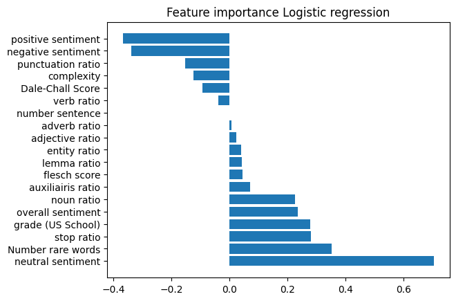
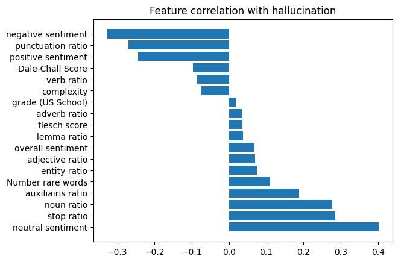
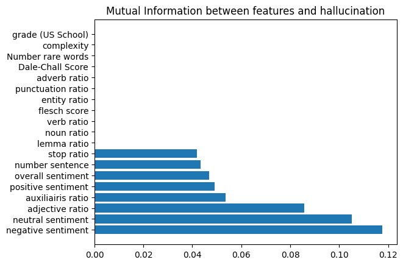

# Project: Reasoning Audits with Benchmarks

### Team: Amine Turki, Daniel Wei Li, Mingxuan Tang, Raj Dhyaneshvar Chennai Jayamoorthy
### Professors: Edmon Begoli, Gomathi Lakshmanan

## Environment setup

```bash
conda create --name env_hallu python=3.11
conda activate env_hallu
pip install -r requirements.txt
```
## LLM judge prototypes
The code goes first through each prompt in truthfulQA dataset, specifically the multiple choice section. It asks gpt-3.5 to make a short response under 30 tokens. The response is recorded and fed to a LLM-judge which is gpt-40 here, that decides if it thinks gpt-3.5 has hallucinated or not. After that, we compute these text features:
 - Prompt length
 - anwser length
 - Number of question marks
 - Contains date
 - Contains 'who'
 - Contains 'what'
 - Contains 'why'
 - Contains 'unknows'

 We feed these features into random forest and compute feature importance. 

## Dataset
The dataset was computed using the [HalluLens GitHub repository](https://github.com/facebookresearch/HalluLens). Task 1 (Precise WikiQA called) was run with N=30. The github requires a huge amount of tokens (1,034,443 tokens used). Since we were always hitting OpenaAi API usage limit, we could only generate 30 questions. We are planning to increase the dataset to 1000 questions for milestone 2. We used gpt-4 to generate questions and awnsers, and gpt-5 to judge 

The output of the github is three json files (dataset folder):
 - generation.jsonl: questions generated
 - eval_results.json: gives where hallucination was detected
 - abstain_eval_raw.jsonl: cache for raw model response

### Dataset sample

| #  | Prompt | Hallucination Score |
|----|---------|--------------------|
| 0  | What is the IUCN conservation status of the Jaguar? | 1 |
| 1  | Who is the author of "The Terrorists of Iraq: Inside the Strategy of the Insurgents"? | 0 |
| 2  | What type of cancer was Ernie Cooksey diagnosed with? | 0 |
| 3  | Who was the architect responsible for the major renovation of the building? | 1 |
| 4  | What was the destination when SMS Moltke transported the troops? | 0 |
| 5  | What is the catalog number of the Final Fantasy IX soundtrack? | 1 |


## Input text features extraction
File feature_extraction.ipynb consists of a Jupyter notebook where we compute different text features using the following packages:
 - Spacy: textual and syntactic features
 - Textstat: text complexity and readability
 - VaderSentiment: sentiment and emotional analysis

Since the dataset is small, we decided to use LogisticRegression, and because we are dealing with a binary classification (label 0: no hallucinaiton detected, label 1: hallucination detected) to compute features importance. 

### Text Features computed

| **Category**               | **Feature Name**     | **Description**                                              |
| -------------------------- | -------------------- | ------------------------------------------------------------ |
| **Linguistic (spaCy)**     | `number sentence`    | Number of sentences in the text                              |
|                            | `lemma ratio`        | Ratio of unique lemmas to total tokens (vocabulary richness) |
|                            | `noun ratio`         | Proportion of nouns among all tokens                         |
|                            | `verb ratio`         | Proportion of verbs among all tokens                         |
|                            | `adjective ratio`    | Proportion of adjectives among all tokens                    |
|                            | `adverb ratio`       | Proportion of adverbs among all tokens                       |
|                            | `auxiliairis ratio`  | Proportion of auxiliary verbs among all tokens               |
|                            | `stop ratio`         | Ratio of stop words in the text                              |
|                            | `punctuation ratio`  | Ratio of punctuation marks in the text                       |
|                            | `entity ratio`       | Ratio of named entities in the text                          |
| **Readability (textstat)** | `flesch score`       | Flesch Reading Ease score (higher = easier to read)          |
|                            | `grade (US School)`  | Estimated U.S. school grade level of the text                |
|                            | `complexity`         | Gunning Fog Index (higher = more complex text)               |
|                            | `Number rare words`  | Number of difficult or uncommon words                        |
|                            | `Dale-Chall Score`   | Dale–Chall readability score                                 |
| **Sentiment (VADER)**      | `negative sentiment` | Intensity of negative sentiment                              |
|                            | `neutral sentiment`  | Intensity of neutral sentiment                               |
|                            | `positive sentiment` | Intensity of positive sentiment                              |
|                            | `overall sentiment`  | Compound sentiment score (overall polarity)                  |


### Features importance computation
Feature importance was computed using:
 - Logistic regression coefficients
 - Matrix correlation
 - Mutual information









## License
Based on Hallulens github license section: "The majority of HalluLens is licensed under CC-BY-NC, however portions of the project are available under separate license terms: https://github.com/shmsw25/FActScore is licensed under the MIT license; VeriScore is licensed under the Apache 2.0 license."


## Citation
```bibtex
@article{bang2025hallulens,
  title={HalluLens: LLM Hallucination Benchmark},
  author={Yejin Bang and Ziwei Ji and Alan Schelten and Anthony Hartshorn and Tara Fowler and Cheng Zhang and Nicola Cancedda and Pascale Fung},
  year={2025},
  eprint={2504.17550},
  archivePrefix={arXiv},
  primaryClass={cs.CL},
  url={https://arxiv.org/abs/2504.17550},
}

@article{honnibal2017spacy,
  title={spaCy 2: Natural Language Understanding with Bloom Embeddings, Convolutional Neural Networks, and Incremental Parsing},
  author={Matthew Honnibal and Ines Montani},
  year={2017},
  note={To appear},
  url={https://spacy.io/}
}

@software{bansal2025textstat,
  title={textstat: A Python library for computing text readability and complexity metrics},
  author={Shivam Bansal and Chaitanya Aggarwal},
  year={2025},
  version={0.7.10},
  url={https://pypi.org/project/textstat/},
  note={Python Package Index (PyPI)}
}

@software{hutto2014vader,
  title={VADER: A Parsimonious Rule‐based Model for Sentiment Analysis of Social Media Text},
  author={C. J. Hutto and E. E. Gilbert},
  year={2014},
  note={Used via vaderSentiment (version 3.3.2) Python package},
  url={https://pypi.org/project/vaderSentiment/}
}

@article{harris2020array,
  title={Array programming with {NumPy}},
  author={Charles R. Harris and K. Jarrod Millman and Stéfan J. van der Walt and Ralf Gommers and Pauli Virtanen and David Cournapeau and Eric Wieser and Julian Taylor and Sebastian Berg and Nathaniel J. Smith and others},
  journal={Nature},
  volume={585},
  pages={357--362},
  year={2020},
  doi={10.1038/s41586-020-2649-2}
}

@article{pedregosa2011scikit,
  title={Scikit-learn: Machine Learning in Python},
  author={Fabian Pedregosa and Gaël Varoquaux and Alexandre Gramfort and Vincent Michel and Bertrand Thirion and Olivier Grisel and Mathieu Blondel and Peter Prettenhofer and Ron Weiss and Vincent Dubourg and others},
  journal={Journal of Machine Learning Research},
  volume={12},
  pages={2825--2830},
  year={2011}
}

@article{mckinney2010data,
  title={Data Structures for Statistical Computing in Python},
  author={Wes McKinney},
  journal={Proceedings of the 9th Python in Science Conference},
  pages={56--61},
  year={2010},
  editor={Stéfan van der Walt and Jarrod Millman}
}

@software{python,
  title = {Python: A Programming Language for Scientific Computing},
  author = {{Python Software Foundation}},
  year = {2025},
  url = {https://www.python.org/}
}


@misc{openai2023api,
  author = {OpenAI},
  title = {OpenAI API: Python Client Library},
  year = {2023},
  url = {https://github.com/openai/openai-python},
  note = {Accessed via the OpenAI API at https://platform.openai.com}
}

@inproceedings{lhoest2021datasets,
  title = {Datasets: A Community Library for Natural Language Processing},
  author = {Quentin Lhoest and Albert Villanova del Moral and Yacine Jernite and Abhishek Thakur and Patrick von Platen and Julien Chaumond and Mariama Drame and Julien Plu and Lewis Tunstall and Joe Davison and others},
  booktitle = {Proceedings of the 2021 Conference on Empirical Methods in Natural Language Processing: System Demonstrations},
  pages = {175--184},
  year = {2021},
  url = {https://github.com/huggingface/datasets}
}

@article{breiman2001randomforest,
  title={Random Forests},
  author={Breiman, Leo},
  journal={Machine Learning},
  volume={45},
  number={1},
  pages={5--32},
  year={2001},
  publisher={Springer}
}